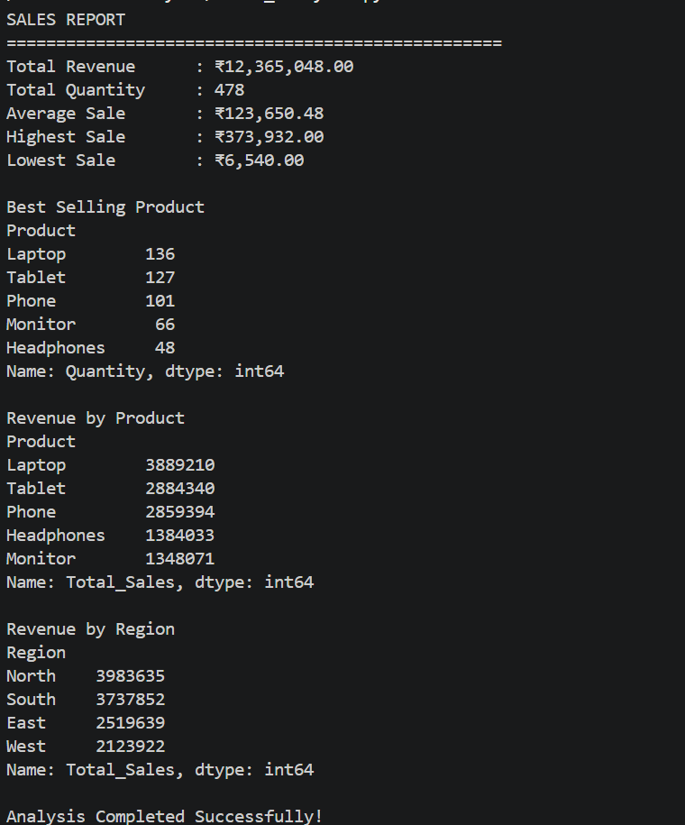

# 📊 Sales Data Analysis using Python & Pandas

A beginner-friendly data analysis project built using **Python** and **Pandas** to analyze sales data. This project demonstrates how to load, clean, analyze, and summarize a sales dataset to extract meaningful business insights.

---

## 🚀 Project Objective

The goal of this project is to analyze a sales dataset and answer key business questions such as:

- What is the total revenue?
- Which product is the best-selling?
- Which region generated the highest sales?
- What is the average sales amount?

---

## 📁 Project Structure

```
Sales-Data-Analysis/
│
├── sales_analysis.py      # Main Python script
├── sales_data.csv         # Sales dataset
├── analysis_report.md     # Analysis summary
├── requirements.txt       # Required libraries
├── README.md              # Project documentation
└── output.png             # Output screenshot (Optional)
```

---

## 🛠️ Technologies Used

- Python 3
- Pandas

---

## 📂 Dataset

The dataset contains the following columns:

| Column | Description |
|---------|-------------|
| Date | Date of Sale |
| Product | Product Name |
| Quantity | Number of Units Sold |
| Price | Price per Unit |
| Customer_ID | Customer Identifier |
| Region | Sales Region |
| Total_Sales | Total Revenue |

---

## ✨ Features

- Load CSV data using Pandas
- Explore dataset structure
- Check data types
- Handle missing values
- Remove duplicate records
- Calculate business metrics
- Identify the best-selling product
- Analyze revenue by region
- Generate a clean summary report

---

## 📈 Metrics Calculated

- Total Revenue
- Total Quantity Sold
- Average Sales
- Highest Sale
- Lowest Sale
- Best-Selling Product
- Revenue by Product
- Revenue by Region

---

## 🧹 Data Cleaning

The following preprocessing steps were performed:

- Checked for missing values
- Filled missing numeric values using the median
- Filled missing text values with `"Unknown"`
- Removed duplicate rows

---

## ▶️ How to Run

### 1. Clone the repository

```bash
https://github.com/Sakshiiikashyap/work
```

### 2. Navigate to the project folder

```bash
cd Sales-Data-Analysis
```

### 3. Install dependencies

```bash
pip install -r requirements.txt
```

### 4. Run the project

```bash
python sales_analysis.py
```

---

## 📷 Sample Output





---

## 💡 Key Insights

- Calculated the total revenue generated from all sales.
- Identified the best-selling product based on quantity sold.
- Compared sales across different regions.
- Cleaned the dataset by handling missing values and duplicates.

---

## 📌 Future Improvements

- Add charts using Matplotlib or Seaborn.
- Create an interactive dashboard.
- Export reports to Excel or PDF.
- Perform monthly and yearly sales analysis.

---

## 👩‍💻 Author

**Sakshi Kashyap**

B.Tech CSE Student | Aspiring Data Analyst | Python | Pandas | Machine Learning

---