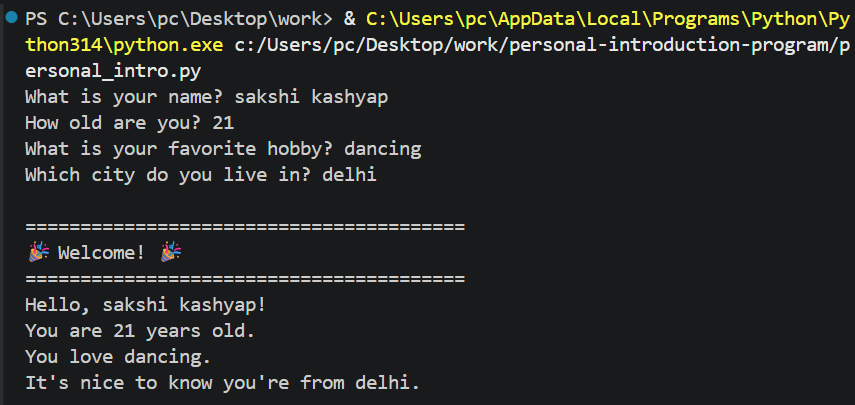

# Personal Introduction Program

## 📌 Project Overview

This is a beginner-friendly Python project that collects basic information from the user using `input()` and displays a personalized welcome message using variables and f-strings.

The purpose of this project is to practice:

- User input
- Variables
- Printing output
- f-strings
- Basic Python syntax

---

## 🎯 Project Objectives

- Learn how to use `input()`
- Store user responses in variables
- Display formatted output
- Create an interactive Python program

---

## 📂 Project Structure

```
Personal-Introduction-Program/
│── personal_intro.py
│── README.md
│── requirements.txt
└── screenshot.png
```

---

## ⚙️ Setup Instructions

### 1. Clone the repository

```bash
git clone https://github.com/sakshiiikashyap/Personal-Introduction-Program.git
```

### 2. Move into the project folder

```bash
cd Personal-Introduction-Program
```

### 3. Run the program

```bash
python personal_intro.py
```

---

## 💻 Sample Output

```
What is your name? Alex
How old are you? 21
What is your favorite hobby? Coding
Which city do you live in? Delhi

========================================
🎉 Welcome! 🎉
========================================
Hello, Alex!
You are 21 years old.
You love Coding.
It's nice to know you're from Delhi.

Have a wonderful day and keep learning Python! 🚀
```

---

## 🧠 What I Learned

During this project, I learned:

- How to take user input using `input()`
- How to store data in variables
- How to use f-strings for formatting
- How to display output using `print()`
- How to organize a simple Python project

---

## 🏗️ Code Structure

- `input()` collects user information.
- Variables store the entered values.
- `print()` and f-strings display personalized output.

---

## ⚙️ Technical Details

### Algorithm

1. Ask the user for their details.
2. Store each response in a variable.
3. Display the collected information in a friendly message.

### Data Structure Used

- Variables (`str`)

### Architecture

Simple sequential execution.

---

## ✅ Testing

### Test Case 1

Input

```
Name: Alex
Age: 21
Hobby: Coding
City: Delhi
```

Expected Output

```
Hello, Alex!
You are 21 years old.
You love Coding.
It's nice to know you're from Delhi.
```

---

### Test Case 2

Input

```
Name: Sakshi
Age: 21
Hobby: Dancing
City: delhi
```

Expected Output

```
Hello, Sakshi!
You are 20 years old.
You love Dancing.
It's nice to know you're from Mumbai.
```

---

## 📷 Screenshot



---

## 👨‍💻 Author

sakshi kashyap